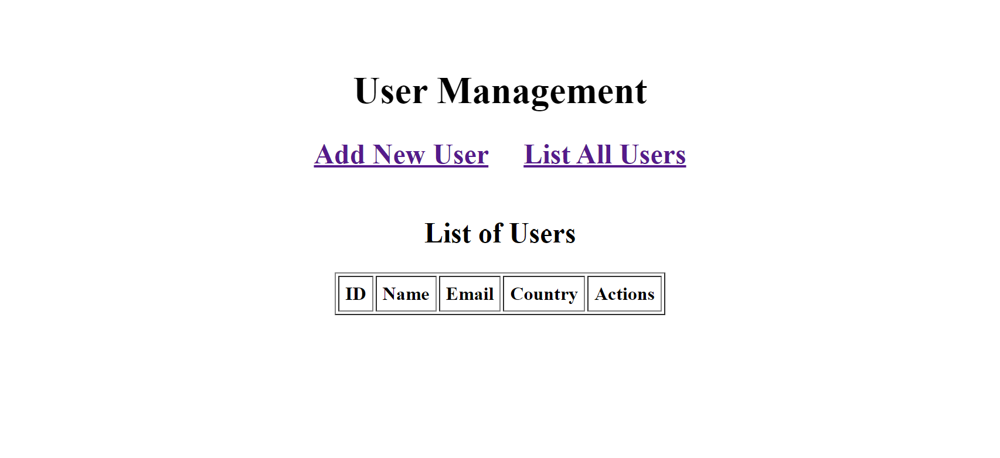
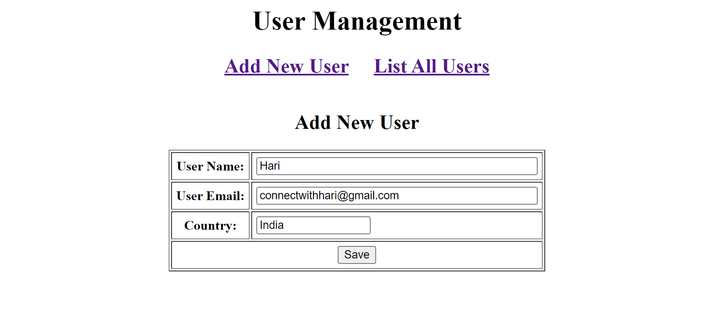

<h1 align="center">User Management System</h1>
<h2 align="center">
    
</h2>

## 🧱 Tech
- Java
- JSP
- Servlet
- Hibernate
- Rest APIs
- MySQL

## 🧾 Description
A web app that performs all the CRUD operations.

## 💻 Setup
- Clone the repository

    ` git clone https://github.com/hari-venkatesh/User-Management-Project.git `
- Install the dependencies
- Boot up a terminal on the directory.
- Run the spring project

## Demo Screenshots
<h2 align="center">
    
</h2>
<h2 align="center">
    
</h2>
